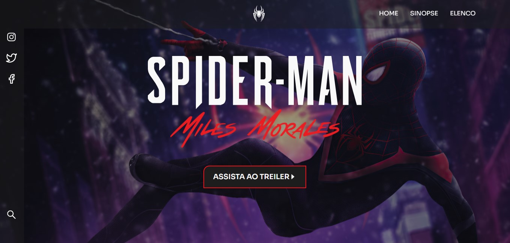

<h1 style="text-align: center;">Spider-Man🕸</h1>

Projeto desenvolvido com o objetivo de exercitar conhecimentos de HTML e CSS, tendo como base o protótipo do <a href="https://www.linkedin.com/in/iuricode/">iuricode</a>.

## Ferramentas

Ferramentas utilizadas neste projeto

✅React JS 
✅HTML 
✅CSS 

## Para Executar

1. Clone o repositório:  `git clone https://github.com/Gusttavo-Larios/Lading-Page-SpiderMan.git`
 
2. Instale as dependências:  `npm install`
 
3. Execute o projeto:  `npm start`
